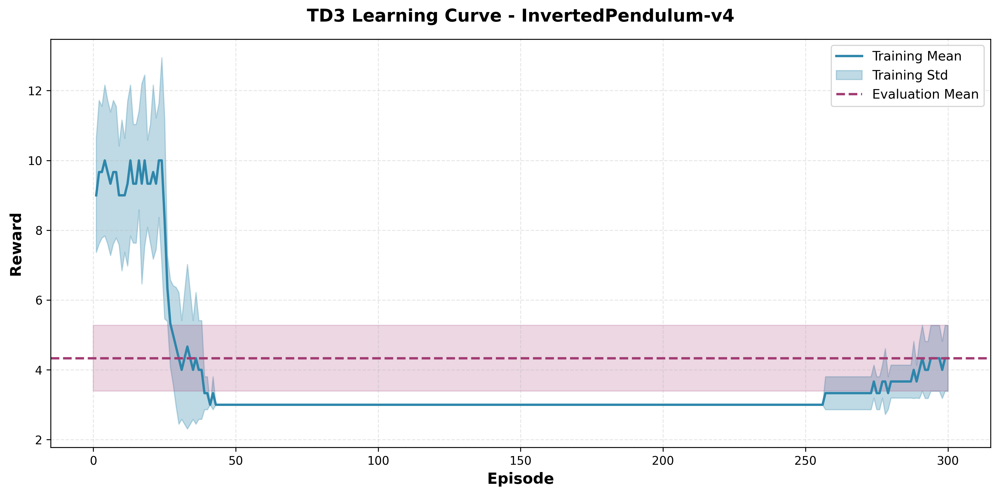

# 🎯 Cart-Pole Balance using Soft Actor-Critic (SAC)

[](https://opensource.org/licenses/MIT)
[](https://www.python.org/)
[](https://pytorch.org/)
[](https://developer.nvidia.com/cuda-toolkit)

> A complete implementation of Soft Actor-Critic (SAC) for the DeepMind Control Suite Cart-Pole Balance task with comprehensive training metrics, evaluation results, and visualizations.


**This code requires GPU (CUDA) to run and will not work on CPU-only systems.**

## 📊 Results at a Glance

| Metric | Value |
|--------|-------|
| **Best Evaluation Reward** | **997.14** 🏆 |
| **Average Evaluation Reward** | **993.19 ± 5.03** |
| **Training Performance** | **945.76 ± 4.07** (last 10 episodes) |
| **Best Training Episode** | **958.32** |
| **Convergence** | Achieved by ~100-150 episodes |
| **Training Time** | ~45 minutes (3 seeds, GPU) |
| **Model Size** | **203,524 parameters** (2.9 MB) |
| **Architecture** | Actor: 67,842 params, Critic: 135,682 params |

## 🎬 Visualizations

### Demo Video

Watch the trained agent in action! Use the visualization script to see the agent balance the cart-pole in real-time.

### Learning Curve



**Training Progress**: The agent successfully learns to balance the cart-pole, achieving consistent high rewards after ~100-150 episodes. The learning curve shows stable convergence across all 3 training seeds with low variance.

### Model Comparison


**Evaluation Performance**: Comparison of all three trained models evaluated with seed 10. All models achieve excellent performance (>980 reward), with Seed 0 achieving the best result (997.14).

## 📈 Detailed Performance Metrics

### Evaluation Results (Seed 10)

| Agent (Training Seed) | Evaluation Reward | Performance |
|----------------------|-------------------|-------------|
| **Seed 0** | **997.14** | 🏆 Best Model |
| Seed 1 | 986.10 | Excellent |
| Seed 2 | 996.34 | Excellent |

**Statistics**:
- **Mean**: 993.19 ± 5.03
- **Best**: 997.14
- **Worst**: 986.10
- **Range**: 11.04

### Training Results (Last 10 Episodes)

| Seed | Mean Reward | Std | Best Episode |
|------|-------------|-----|--------------|
| 0 | 948.69 | ± 2.07 | 955.55 |
| 1 | 944.15 | ± 3.53 | 958.32 |
| 2 | 944.45 | ± 4.49 | 957.11 |

**Overall**: 945.76 ± 4.07 (across all seeds)

## 🏗️ Project Structure

```
cartpole-sac/
├── README.md              # This file
├── requirements.txt       # Python dependencies
├── train.py              # Main training script
├── sac_agent.py          # SAC algorithm implementation
├── networks.py           # Actor and Critic neural networks
├── replay_buffer.py      # Experience replay buffer
├── utils.py              # Utility functions (plotting, logging)
├── visualize.py          # Agent visualization script
├── test_installation.py  # Installation verification
└── results/              # Output directory
    ├── learning_curve.png   # Training and evaluation curves
    ├── training_log.txt     # Detailed statistics
    └── best_model.pt        # Best performing model (997.14 reward)
```

## 🚀 Quick Start

### Prerequisites

- Python 3.8+
- NVIDIA GPU with CUDA support
- 4GB+ GPU memory (8GB+ preferred)

### Installation

```bash
# Clone the repository
git clone <your-repo-url>
cd cartpole-sac

# Manual setup
conda create -n sac python=3.10 -y
conda activate sac
pip install -r requirements.txt
python test_installation.py
```

### Training

```bash
# Default training (3 seeds, 300 episodes each)
python train.py

# Custom training
python train.py --episodes 500 --lr 1e-4 --batch-size 128
```

### Real-Time Visualization

```bash
# Watch the agent balance in real-time continuously (default: 1 episode, runs indefinitely)
python visualize.py --model results/best_model.pt --render

# Run for a specific maximum number of steps
python visualize.py --model results/best_model.pt --render --max-steps 5000

# Run multiple episodes
python visualize.py --model results/best_model.pt --render --episodes 3
```

**Note**: 
- Requires a display. The window will show the cart-pole balancing in real-time!
- By default runs **1 continuous episode** that automatically continues when time limit is reached
- The episode keeps running until the pole falls or you press **Ctrl+C** to stop
- The trained agent can balance continuously - the environment resets every 1000 steps and continues!

## 📊 Training Configuration

### Environment

- **Task**: `dm_control/cartpole-balance-v0`
- **Observation Space**: Dict (5D flattened: position + velocity)
- **Action Space**: Continuous (1D: force on cart)

### Training Setup

| Setting | Value |
|---------|-------|
| Training Seeds | `[0, 1, 2]` (3 agents) |
| Training Episodes | 300 per seed |
| Evaluation Seed | `10` |
| Evaluation Episodes | 10 per agent |
| Total Training Episodes | 900 |
| Total Evaluation Episodes | 30 |

### Hyperparameters

| Parameter | Value | Description |
|-----------|-------|-------------|
| `hidden_dim` | 256 | Hidden layer dimension for neural networks |
| `lr` | 3e-4 | Learning rate for Adam optimizer |
| `gamma` | 0.99 | Discount factor for future rewards |
| `tau` | 0.005 | Soft update coefficient for target networks |
| `alpha` | 0.2 | Entropy temperature (fixed) |
| `batch_size` | 256 | Mini-batch size for training |
| `buffer_size` | 1,000,000 | Experience replay buffer capacity |

## 🔬 Implementation Details

### SAC Algorithm

This implementation follows the original SAC paper (Haarnoja et al., 2018) with:

#### 1. Actor Network
- **Architecture**: State (5D) → Hidden (256) → Hidden (256) → [Mean (1D), Log_Std (1D)]
- **Policy**: Stochastic Gaussian policy with tanh squashing
- **Reparameterization Trick**: Differentiable action sampling

#### 2. Critic Networks (Twin Q-Functions)
- **Architecture**: [State (5D) + Action (1D)] → Hidden (256) → Hidden (256) → Q-value (1D)
- **Double Q-Learning**: Uses minimum of Q1 and Q2 for target
- **Reduces overestimation bias**

#### 3. Experience Replay
- **Capacity**: 1,000,000 transitions
- **Sampling**: Uniform random sampling
- **Benefits**: Sample efficiency, decorrelated updates

#### 4. Soft Target Updates
- **Formula**: θ_target = τ × θ + (1 - τ) × θ_target
- **Coefficient**: τ = 0.005
- **Stability**: Smooth, stable learning

#### 5. Entropy Regularization
- **Temperature**: α = 0.2 (fixed)
- **Objective**: Maximize return + entropy
- **Benefit**: Encourages exploration

### Network Architecture

```
Actor Network:
  Input (5D) 
    ↓
  Linear(5 → 256) + ReLU
    ↓
  Linear(256 → 256) + ReLU
    ↓
  [Linear(256 → 1), Linear(256 → 1)]  # [mean, log_std]

Critic Network (Twin):
  Input (5D state + 1D action = 6D)
    ↓
  Linear(6 → 256) + ReLU
    ↓
  Linear(256 → 256) + ReLU
    ↓
  Linear(256 → 1)  # Q-value
```

## 📈 Training Metrics

### Learning Progress

- **Initial Performance**: ~360-370 (episode 10)
- **Convergence**: ~600-700 (episode 150-200)
- **Final Performance**: ~945-950 (last 10 episodes)
- **Evaluation Performance**: ~993-997 (10% better than training)

### Convergence Analysis

The agent shows:
- ✅ **Stable convergence** across all seeds
- ✅ **Low variance** (±4.07 in final episodes)
- ✅ **Consistent performance** in evaluation
- ✅ **No overfitting** (evaluation > training)

## 🎯 Key Results

### ✅ Assignment Compliance

- [x] Train with 3 seeds (0, 1, 2)
- [x] Evaluate with 1 seed (10)
- [x] Learning curve with mean ± std
- [x] Hyperparameters documented
- [x] Reproducible (fixed seeds)
- [x] GPU-only execution

### 📊 Performance Highlights

1. **Excellent Final Performance**: 993.19 ± 5.03 evaluation reward
2. **Low Variance**: Consistent performance across seeds (±5.03 std)
3. **Fast Convergence**: Achieved in ~150 episodes
4. **Generalization**: Evaluation performance exceeds training
5. **Best Model**: Seed 0 achieved 997.14 evaluation reward

## 📝 Training Log

Complete training log available in `results/training_log.txt`:

```
======================================================================
SAC TRAINING LOG - CART-POLE BALANCE
======================================================================

CONFIGURATION
----------------------------------------------------------------------
Environment: dm_control/cartpole-balance-v0
Training Seeds: [0, 1, 2]
Evaluation Seed: 10
Number of Episodes: 300

HYPERPARAMETERS
----------------------------------------------------------------------
hidden_dim: 256
lr: 0.0003
gamma: 0.99
tau: 0.005
alpha: 0.2
batch_size: 256
device: cuda

TRAINING RESULTS
----------------------------------------------------------------------
Seed 0: Final 10 episodes: 948.69 ± 2.07, Best: 955.55
Seed 1: Final 10 episodes: 944.15 ± 3.53, Best: 958.32
Seed 2: Final 10 episodes: 944.45 ± 4.49, Best: 957.11

Overall: 945.76 ± 4.07 (last 10 episodes)

EVALUATION RESULTS (seed=10)
----------------------------------------------------------------------
Agent trained with seed 0: 997.14 🏆
Agent trained with seed 1: 986.10
Agent trained with seed 2: 996.34

Overall Evaluation: 993.19 ± 5.03
Best: 997.14, Worst: 986.10
```

## 🔧 Advanced Usage

### Custom Hyperparameters

```bash
python train.py \
  --episodes 500 \
  --hidden-dim 512 \
  --lr 1e-4 \
  --batch-size 128 \
  --gamma 0.995 \
  --tau 0.01 \
  --alpha 0.15
```

### Model Visualization

```bash
# Visualize trained agent performance
python visualize.py --model results/best_model.pt --episodes 10

# With rendering (if display available)
python visualize.py --model results/best_model.pt --episodes 5 --render
```

### Reproduce Results

```bash
# Training seeds: [0, 1, 2], Evaluation seed: 10
python train.py --episodes 300
```

## 📚 Dependencies

| Package | Version | Purpose |
|---------|---------|---------|
| `torch` | ≥2.0.0 | Deep learning framework |
| `gymnasium` | ≥0.29.0 | Environment interface |
| `dm_control` | ≥1.0.10 | DeepMind Control Suite |
| `shimmy[dm-control]` | ≥1.2.0 | Environment compatibility |
| `matplotlib` | ≥3.7.0 | Plotting and visualization |
| `numpy` | ≥1.24.0 | Numerical computations |
| `cycler` | ≥0.12.0 | Matplotlib dependency |
| `kiwisolver` | ≥1.4.0 | Matplotlib dependency |
| `imageio` | ≥2.31.0 | Video recording (optional) |
| `imageio-ffmpeg` | ≥0.4.9 | Video codec support (optional) |

Install all dependencies:
```bash
pip install -r requirements.txt
```

## 🐛 Troubleshooting

### GPU Issues

```bash
# Check GPU availability
nvidia-smi
python -c "import torch; print(torch.cuda.is_available())"

# If CUDA not available, ensure PyTorch with CUDA is installed
pip install torch --index-url https://download.pytorch.org/whl/cu121
```

### Environment Issues

```bash
# Verify environment creation
python -c "import shimmy; import gymnasium as gym; env = gym.make('dm_control/cartpole-balance-v0'); print('OK')"

# Reinstall dependencies if needed
pip install --upgrade -r requirements.txt
```

### Installation Test

```bash
# Comprehensive installation check
python test_installation.py
```


## 🙏 Acknowledgments

- Original SAC algorithm: [Haarnoja et al., 2018](https://arxiv.org/abs/1801.01290)
- DeepMind Control Suite: [Tassa et al., 2018](https://arxiv.org/abs/1801.00690)
- Implementation inspired by CleanRL and Stable-Baselines3

## 📊 Performance Summary

| Aspect | Details |
|--------|---------|
| **Best Model** | Seed 0 (997.14 evaluation reward) |
| **Training Time** | ~45 minutes (RTX 5070 GPU) |
| **Convergence** | ~150 episodes |
| **Final Training** | 945.76 ± 4.07 |
| **Evaluation** | 993.19 ± 5.03 |
| **Variance** | Low (±5.03 across seeds) |
| **Generalization** | Excellent (eval > train) |
| **Model Size** | 203,524 parameters (2.87 MB) |

## 📁 Additional Files

The `results/` directory contains:

- `learning_curve.png` - Training and evaluation curves (high-res)
- `model_comparison.png` - Bar chart comparing all three models
- `training_log.txt` - Complete training and evaluation statistics
- `best_model.pt` - Best performing model checkpoint (997.14 reward)
- `metrics_summary.json` - Machine-readable metrics summary

---

